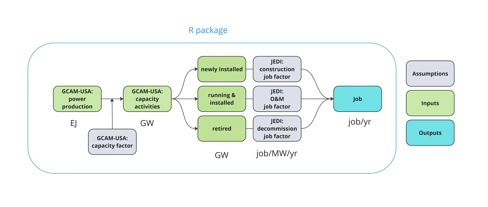

# Summary

`GCAMUSAJobs` R package was developed to post-process power sector projections from GCAM-USA, enabling the estimation of future state-level jobs by fuel technology and job types. `GCAMUSAJobs` extends GCAM-USA functionality by (1) estimating the capacity levels of different activities – operational capacity, capacity addition, and retirement; and (2) calculating jobs associated with production activities, including those in operation and maintenance (O&M), construction, and decommissioning.

# Statement of need

The development of `GCAMUSAJobs` was driven by the need to assess the distributional labor impacts of energy system transition [@xie2023distributional; @mayfield2023labor; @hanson2023local; @raimi2021mapping]. While gross employment [@mayfield2023labor] and power sector employment [@xie2023distributional] are expected to grow overtime under decarbonization, fossil fuel-intensive states may experience slower job growth or job losses [@hanson2023local; @xie2023distributional; @mayfield2023labor].

Currently, GCAM-USA does not calculate power sector jobs. `GCAMUSAJobs` addresses this gap by providing projected direct power sector jobs based on GCAM-USA output, enhancing the functionality of GCAM-USA for labor impact analysis.

# Workflow

`GCAMUSAJobs` utilizes GCAM-USA power generation outputs to estimate underlying capacity levels based on assumptions about capacity factors and calculate associated jobs based on employment factors (Fig. 1). The employment factor represents the average number of jobs created per unit of power production activity (e.g., jobs per gigawatt). This method is widely used in the relevant literature [@rutovitz2015calculating; @mayfield2023labor]. `GCAMUSAJobs` adopts employment factors from NREL’s Jobs & Economic Development Impacts (JEDI) model (<https://www.nrel.gov/analysis/jedi/models.html>), a commonly used resource [@xie2023distributional; @rutovitz2015calculating; @jacobson2017100].

# Key functions

`GCAMUSAJobs::GCAM_EJ` queries power generation data from the GCAM-USA output database for a single scenario, calculating the implied power generation (in exajoules, EJ) associated with installed capacity, newly added capacity, and retired capacity. The output is provided annually, disaggregated by state and fuel technology. Building on this, `GCAMUSAJobs::GCAM_GW`, taking the output from `GCAMUSAJobs::GCAM_EJ`, calculates the average annual capacity levels (in gigawatts, GW) by state and fuel technology for different activities, including operation, addition, and retirement. It supports both the “Total” and “Net” methods. The “Total” method allows capacity addition and pre-mature retirement of a given technology to happen in the same period, while the “Net” method assumes that only the difference between these two activities would occur. It therefore offsets the addition by pre-mature retirement, providing adjusted capacity levels by activities. `GCAMUSAJobs::GCAM_JOB` then utilizes the output from `GCAMUSAJobs::GCAM_GW` to estimate the average annual job estimates, broken down by fuel type and job type, including construction (both on-site and construction-related), operations & maintenance, and decommissioning. Users can select between the “Total” or “Net” method, with “Total” used as the default. `GCAMUSAJobs` also provides a list of functions to visualize the employment factor assumptions, capacity and job outcomes.

`GCAMUSAJobs::GCAM_EJ` is compatible with both the GCAM-USA output database as well as a project data file queried using the R package `rgcam`. Please refer to the package vignette for additional examples and visualizations.

## Implementation

For demonstration purposes, we use `GCAMUSAJobs` to post-process the outcome from GCAM v7.1 for a standard reference scenario, estimating the direct job, aggregated over states, associated with U.S. power generation (Fig. 2).

# Acknowledgment

This research was supported by the Laboratory Directed Research and Development (LDRD) Program at Pacific Northwest National Laboratory (PNNL). PNNL is a multi-program national laboratory operated for the U.S. Department of Energy (DOE) by Battelle Memorial Institute under Contract No. DE-AC05-76RL01830. We also appreciate the support from Kanishka Narayan, Ben Bond-Lamberty, Mengqi Zhao, and Gokul Iyer. The views and opinions expressed in this paper are those of the authors alone.

# References
